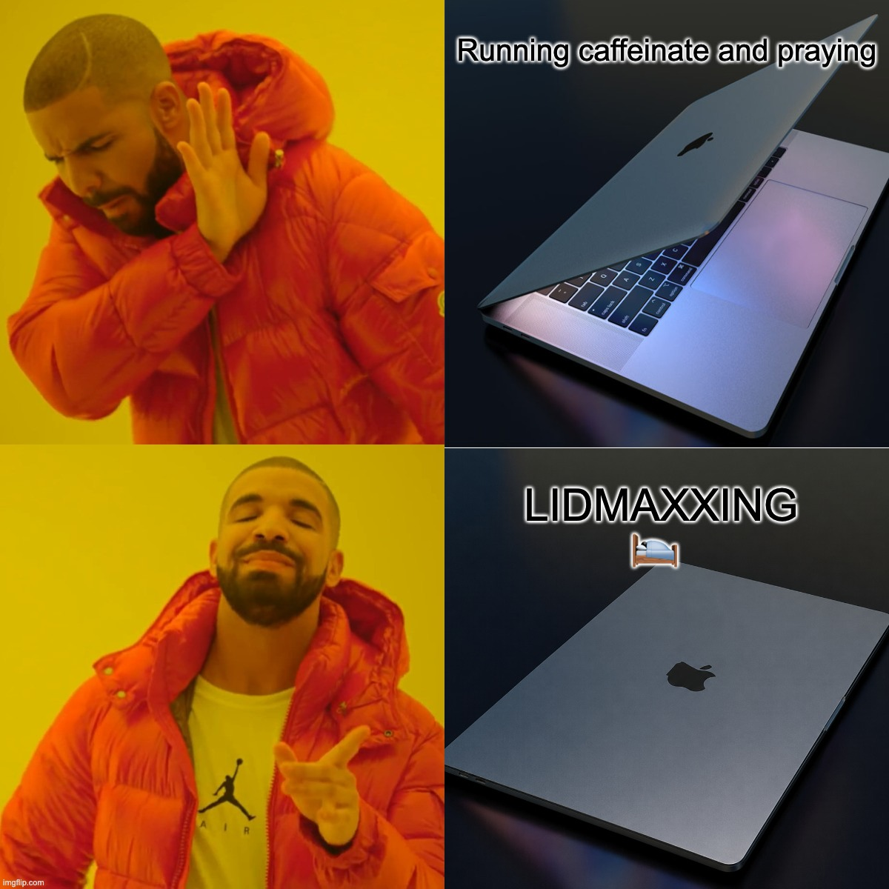

# lidmaxxing ☕

**Close the lid, keep maxxing.**

<p align="center">
  
</p>

A tiny CLI that keeps your MacBook fully awake with the lid shut, so your
coding agents — Claude Code, Codex, OpenCode, anything — keep running while you walk away — instead of
leaving the lid propped open like a savage.

```
lidmaxxing on        # close lid, walk away, agents keep maxxing
lidmaxxing off       # back to normal sleep
lidmaxxing -- claude # or scope it to a single command (auto-cleans up)
```

## Why this exists

You're running an agent. You leave the lid open so it doesn't die. We can do
better.

`caffeinate` (and every menu-bar "stay awake" app built on it) prevents **idle
sleep** — but it does **not** prevent **clamshell sleep**, the sleep that fires
the instant the lid's magnetic sensor trips. Those are two different triggers,
and closing the lid bypasses every power assertion.

The only knob that disables the lid trigger without needing an external monitor
plugged in is `pmset disablesleep`, which needs root. `lidmaxxing` is a small,
auditable wrapper that flips it safely and **always restores it**.

## How it works

When you turn it on, it sets exactly two things:

| Knob | Effect | Needs root |
|------|--------|------------|
| `pmset -a disablesleep 1` | Closing the lid no longer sleeps the Mac | yes |
| `caffeinate -i` | Idle sleep can't fire either (separate trigger) | no |

When you turn it off (or a wrapped command exits, or you Ctrl-C, or it crashes),
both are restored: `disablesleep 0` and the `caffeinate` assertion is released.

**It never touches the display.** Closing the lid turns the internal screen off
on its own — that's the hardware, and it's what you want (less heat, less
power). Reopening the lid drops you straight back into your session, because the
Mac never actually slept.

## Works with any agent

lidmaxxing keeps the **whole machine** awake — it doesn't hook into any specific
app, so there's nothing agent-specific to configure or update. Claude Code,
Codex, OpenCode, a long build, a training run — if it's running when you close
the lid, it keeps running.

```sh
lidmaxxing on            # keeps everything alive, whatever you're running
lidmaxxing -- codex      # ...or scope it to a single agent
lidmaxxing -- opencode
lidmaxxing -- claude
```

## Compatibility

Verified on **macOS 15 "Sequoia" (15.7.3), Apple Silicon**. Expected to work on
both Apple Silicon and Intel Macs and on modern macOS releases generally — with
one honest caveat below.

- **`caffeinate -i`** is documented, built-in, and present since **OS X 10.8
  "Mountain Lion" (2012)**. Solid everywhere. ✅
- **`pmset disablesleep`** is the part that beats lid-close sleep, and it's
  **undocumented** — it isn't in `man pmset`. It flips the kernel's
  `SleepDisabled` flag, which is what lets the Mac ignore a closed lid with *no
  external display attached*. It's long-standing and widely relied on by
  clamshell tools, reported working on Apple Silicon and Intel — but because
  Apple doesn't document it, there's **no guarantee a future macOS won't change
  it.**

**Good to know:**

- **No SIP changes, no kernel extension** — just an admin password for the
  `pmset` call.
- **Resets on reboot.** `disablesleep` reverts after a restart; re-run
  `lidmaxxing on`.
- **Critical battery still forces sleep**, by design. Stay on AC.
- **No hard minimum version we'll promise.** `disablesleep` didn't exist in 10.6
  and has been around since roughly the 10.9–10.10 era, but we won't pin a floor
  we can't verify. The real test: if `sudo pmset -a disablesleep 1` succeeds,
  you're good — `pmset -g | grep -i SleepDisabled` will then show it's active.

## Install

### Homebrew (recommended)

```sh
brew install chipsforbeer/tap/lidmaxxing
```

### Manual

```sh
git clone https://github.com/chipsforbeer/lidmaxxing.git
cd lidmaxxing
ln -s "$PWD/bin/lidmaxxing" /usr/local/bin/lidmaxxing   # or anywhere on your PATH
```

It's a single Bash script with no dependencies beyond macOS's built-in `pmset`
and `caffeinate`. Read it — it's short on purpose.

## Usage

```
lidmaxxing on            Turn it on; stays on until you turn it off.
lidmaxxing off           Turn it off; restore normal sleep. (panic button)
lidmaxxing status        Show whether it's on, plus current power source.
lidmaxxing -- <cmd...>   Turn on, run <cmd>, auto-restore sleep on exit.
lidmaxxing help          Show this help.
lidmaxxing version       Show version.
```

### The two flows

**Already running an agent?** Flip it on, walk away, flip it off later:

```sh
lidmaxxing on
#   ...close the lid. open it whenever. your session is right where you left it.
lidmaxxing off
```

**Want it scoped to one command?** Wrap it — sleep is restored automatically
when the command exits, even on Ctrl-C or a crash:

```sh
lidmaxxing -- claude     # also works with: codex, opencode, or any command
```

## ⚠️ Disclaimers — read this

- **It's your job to turn it off.** `lidmaxxing on` stays on until you run
  `lidmaxxing off`. Leaving it on, unplugging, and tossing the Mac in a bag will
  drain the battery and heat up a sealed laptop. The `--` wrapper form
  auto-restores; the `on` form does not. By design — this is a dev tool, you're
  the adult.
- **Use AC power.** A closed lid running an agent on battery just drains it.
  `lidmaxxing` warns you when you enable it on battery.
- **Thermals.** Apple Silicon handles sustained closed-lid load fine. Intel
  MacBooks run hotter with the lid shut — keep an eye on it.
- **Needs admin.** Only the `pmset` call uses `sudo`; you'll be prompted once
  per toggle.
- No warranty. It flips documented macOS power settings and restores them. Read
  the source.

## Make it your own

It's MIT licensed and intentionally tiny. Want a menu-bar UI, an auto-off timer,
a "disable when battery < 20%" guard, or a "turn off when no agent process is
left" watcher? Fork it and build it — the core logic is one readable function.

## License

[MIT](LICENSE)
